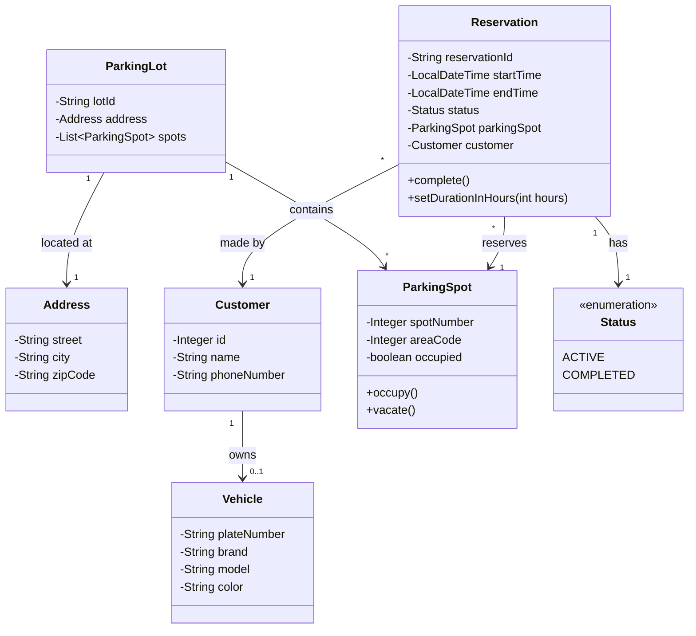
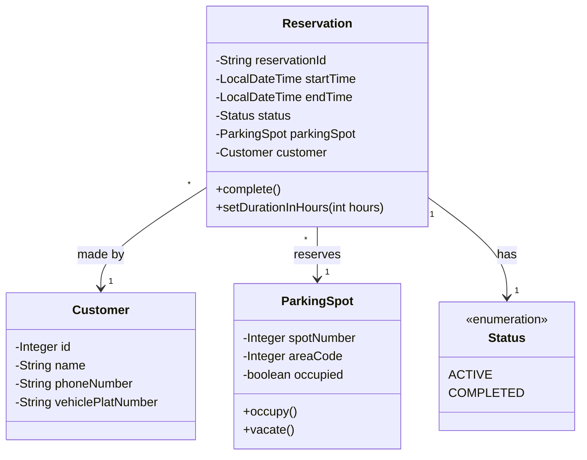

# **Parking App**

Create a Java console application using OOP principles to manage customer registration (including vehicle details), parking spot availability, and parking spot reservations.

The objective is to design a parking lot system that allows customers to register their vehicles and view real-time parking spot availability. The parking lot contains multiple parking spots, each of which can be reserved by only one customer at a time. A customer may book a single parking spot for a specific duration, during which the system marks the spot as occupied and generates a unique reservation ID. Once the customer leaves, the reservation is completed and the parking spot is marked as available again, ensuring accurate tracking and efficient use of parking resources.

## **The Workflow:**

- A customer is registered in the system with their vehicle information.
- The system manages a list of parking spots and identifies available ones for the customer (e.g., spots marked with a green checkmark in the diagram).
- A reservation is created using the terminal, linking the customer to a specific spot for a set duration. The spot's status is updated to occupied (marked with a red 'X').
- When the customer departs, the spot is vacated, making it available for future use, and the reservation is marked as completed.

## Main Task

The main task is to identify the key entities, represent them as classes in a class diagram, and define their relationships. The system should also implement core functionalities such as:

- Customer registration
- Parking spot management (occupy and vacate)
- Reservation management

### **Real-World Scenario**

Sarah wants to park in parking area 101. Here's how the system works:

1. **Registration**: She registers in the system by providing:
    - Her name: "Sarah Johnson"
    - Her phone number: "5551234567"
    - Her vehicle's plate number: "XYZ-789"

2. **Finding a Spot**: The system displays available parking spots in Area 101. She sees that Spot 3 is available (
   marked with a green checkmark on the display).

3. **Making a Reservation**: Sarah selects Spot 3 and indicates she plans to stay for 3 hours. The system:
    - Creates a reservation with a unique ID (e.g., "RES-20240115-001")
    - Records the start time as the current time
    - Calculates the end time as 3 hours from now
    - Automatically marks Spot 3 as occupied (changes to a red 'X' on the display)
    - Updates the reservation status to ACTIVE

4. **Parking**: Sarah parks her car in Spot 3, Area 101, and goes shopping.

5. **Departure**: After 2.5 hours, Sarah returns to her car and exits the parking lot. The system:
    - Detects her departure (either through sensors or manual checkout)
    - Marks the reservation as COMPLETED
    - Automatically updates Spot 3 status to available (changes back to green checkmark)
    - Makes the spot ready for the next customer

---

### **Modeling Entities**

In a real-world scenario (like **Area 101** shown in the image), a parking system would involve several complex entities. Below is an overview of how we can model these entities:

1. **Parking Lot**: To group parking spots and manage capacity (e.g., a lot containing spots 1 to 10).
2. **Vehicle**: To store more details like brand, model, and color (currently simplified as a string in `Customer`).
3. **Customer**: Represents the user of the parking service.
4. **Parking Spot**: Represents the physical space for parking (identified by a spot number).
5. **Reservation**: Tracks the booking and occupancy details.
6. **Address**: To store location details for the company or its parking lot.

### **Class Diagram**

### **Simplified Class Diagram**

To keep it simple and focused on the core logic, we have implemented the following:

1. **Customer**:
   - **Purpose**: Represents an individual who uses the parking services.
   - `id`: A unique identifier for the customer.
   - `name`: The customer's full name.
   - `phoneNumber`: Contact information for the customer.
   - `vehiclePlatNumber`: The plate number of the vehicle associated with the customer.

2. **Parking Spot**:
   - **Purpose**: Represents a physical space in the parking lot where a vehicle can be parked (e.g., Spot 1, 2, or 3 in **Area 101**).
   - `spotNumber`: A unique identifier for the parking spot.
   - `areaCode`: A code representing the specific section or area where the spot is located (e.g., 101).
   - `occupied`: A boolean status indicating whether the spot is currently taken or available.

3. **Reservation**:
   - **Purpose**: Acts as a contract between a customer and a parking spot for a specific duration.
   - `reservationId`: A unique identifier generated for each booking.
   - `startTime`: The exact date and time when the reservation begins.
   - `endTime`: The scheduled date and time when the reservation expires.
   - `customer`: The customer who made the reservation.
   - `parkingSpot`: The specific spot assigned to the reservation.
   - `status`: The current state of the reservation (e.g., ACTIVE, COMPLETED).

---

### **Core Functionalities**

1. **Customer Management**:
   - Register customers with unique identifiers.
   - Validate customer information, including name and phone number formats.
   - Associate a vehicle plate number with each customer.

2. **Parking Spot Management**:
   - Maintain a list of parking spots to represent the parking lot.
   - Track the availability of parking spots in real-time.
   - Organize spots by area codes for better categorization.
   - Ability to mark spots as occupied or vacant (automatically handled by the Reservation system).

3. **Reservation System**:
   - Create reservations linking customers to specific parking spots.
   - Automatically generate unique reservation IDs.
   - Set reservation duration (in hours) and calculate end times.
   - Track the status of reservations (ACTIVE, COMPLETED, CANCELLED).
   - Complete reservations, which automatically updates the status.

---
